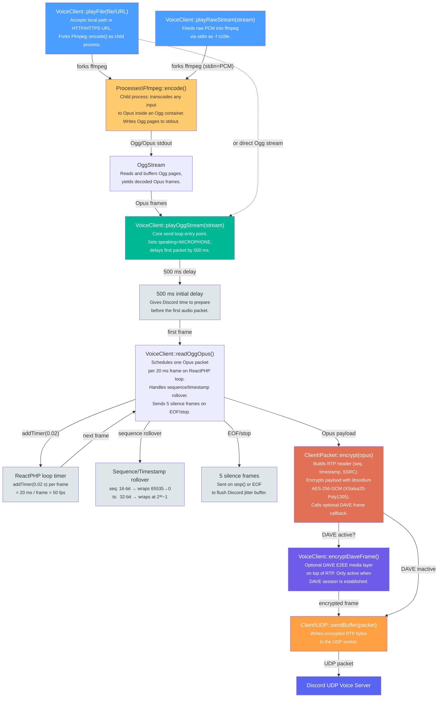
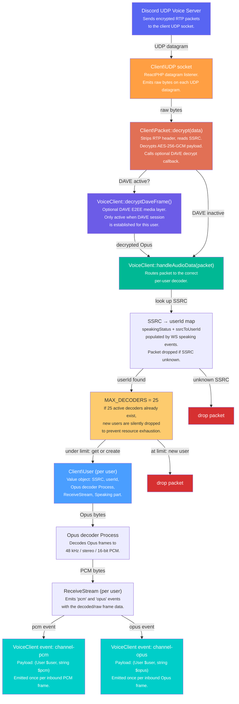
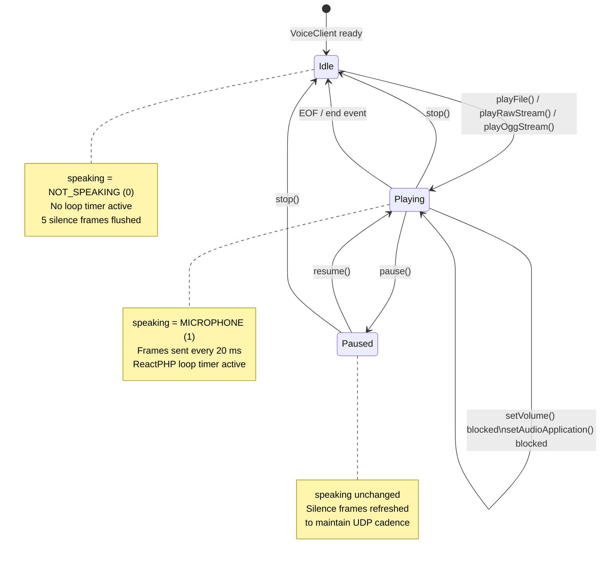

# Audio Pipeline

This document provides visual diagrams of how DiscordPHP-Voice processes audio in both directions — outbound (your application sending audio to Discord) and inbound (receiving audio from other users). All diagrams use [Mermaid](https://mermaid.js.org/) syntax, which GitHub renders natively.

---

## Table of Contents

- [Outbound Audio Pipeline](#outbound-audio-pipeline)
- [Inbound Audio Pipeline](#inbound-audio-pipeline)
- [Playback State Machine](#playback-state-machine)
- [Audio Format Chain](#audio-format-chain)

---

## Outbound Audio Pipeline

The full path from a `playFile()` / `playRawStream()` / `playOggStream()` call to encrypted RTP packets leaving the UDP socket.

### Key timing details

| Detail | Value |
|---|---|
| Initial send delay | 500 ms |
| Frame duration | 20 ms (50 fps) |
| Opus frame size | 960 samples @ 48 kHz |
| Sequence counter width | 16-bit (wraps 65535 → 0) |
| Timestamp counter width | 32-bit (wraps 2³²−1 → 0) |
| Silence frames on stop/EOF | 5 frames |

---

## Inbound Audio Pipeline

The path from raw bytes arriving on the UDP socket to `channel-pcm` / `channel-opus` events emitted by `VoiceClient`.

---

## Playback State Machine

States and transitions for the outbound audio playback lifecycle.

### Playback control methods

| Method | Allowed states | Effect |
|---|---|---|
| `playFile(file)` | Idle | Start playback from file/URL |
| `playRawStream(stream)` | Idle | Start playback from PCM stream |
| `playOggStream(stream)` | Idle | Start playback from Ogg/Opus stream |
| `pause()` | Playing | Suspend; send silence frames to keep cadence |
| `resume()` | Paused | Continue from where paused |
| `stop()` | Playing, Paused | Drain buffer, send 5 silence frames, → Idle |
| `setVolume(vol)` | Idle only | Adjusts ffmpeg volume filter |
| `setAudioApplication(app)` | Idle only | Changes Opus application mode |

### Speaking flags (bitmask)

| Constant | Value | Meaning |
|---|---|---|
| `NOT_SPEAKING` | `0` | Silent |
| `MICROPHONE` | `1` | Normal voice audio |
| `SOUNDSHARE` | `2` | Screen-share audio |
| `PRIORITY_SPEAKER` | `4` | Ducks other speakers |

---

## Audio Format Chain

Format conversions from application input to bytes on the wire.

```mermaid
graph LR
    IN["Input<br/><small>MP3 / WAV / FLAC / AAC<br/>HTTP/HTTPS URL / PCM stream</small>"]
    FFMPEG["FFmpeg<br/><small>Transcodes to Opus<br/>48 kHz stereo 128 kbps<br/>wrapped in Ogg container</small>"]
    OPUS["Ogg/Opus<br/><small>Variable-bitrate Opus frames<br/>20 ms / 960 samples each</small>"]
    RTP["RTP Packet<br/><small>12-byte header:<br/>V=2, PT=120, seq, ts, SSRC<br/>+ raw Opus payload</small>"]
    ERTP["Encrypted RTP<br/><small>libsodium AES-256-GCM<br/>(XSalsa20-Poly1305)<br/>nonce derived from RTP header</small>"]
    DAVE["DAVE E2EE Frame<br/><small>MLS-derived key ratchet<br/>wraps the encrypted RTP frame.<br/>Only present when DAVE active.</small>"]
    WIRE["Discord UDP Wire<br/><small>Raw UDP datagram<br/>sent to Discord voice server</small>"]

    IN -->|"ffmpeg child process"| FFMPEG
    FFMPEG -->|"stdout Ogg pages"| OPUS
    OPUS -->|"Packet::encrypt()"| RTP
    RTP -->|"libsodium seal"| ERTP
    ERTP -->|"encryptDaveFrame()\n[optional]"| DAVE
    DAVE -->|"UDP::sendBuffer()"| WIRE
    ERTP -->|"UDP::sendBuffer()\n[no DAVE]"| WIRE

    style IN fill:#4a9eff,color:#fff
    style FFMPEG fill:#fdcb6e,color:#333
    style OPUS fill:#00b894,color:#fff
    style RTP fill:#e17055,color:#fff
    style ERTP fill:#d63031,color:#fff
    style DAVE fill:#6c5ce7,color:#fff
    style WIRE fill:#5865f2,color:#fff
```

The inbound path reverses this chain: `WIRE → ERTP → RTP → [DAVE decrypt] → Opus → PCM`.
