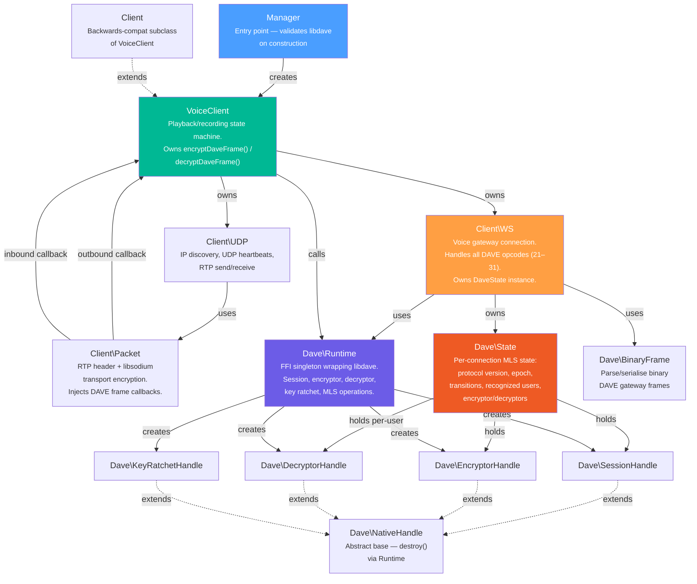
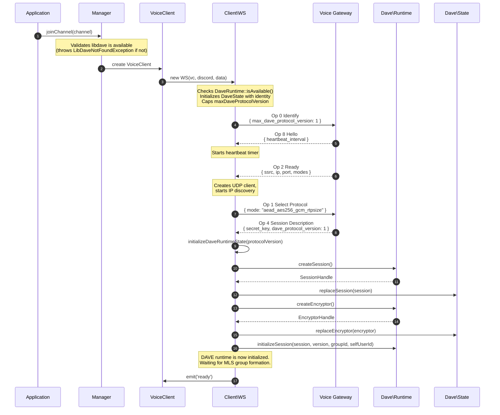
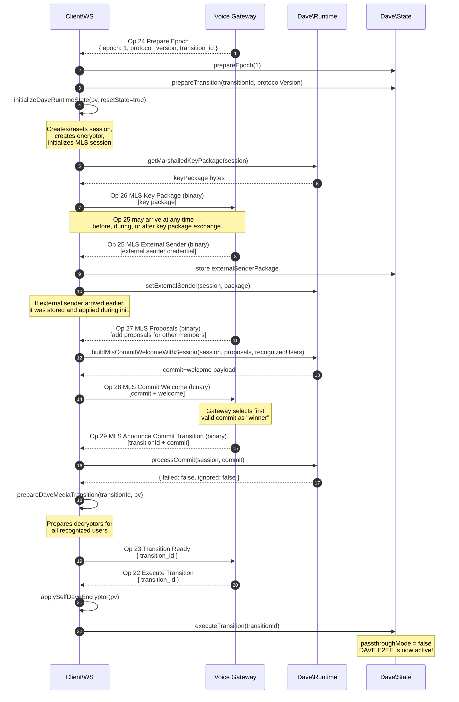
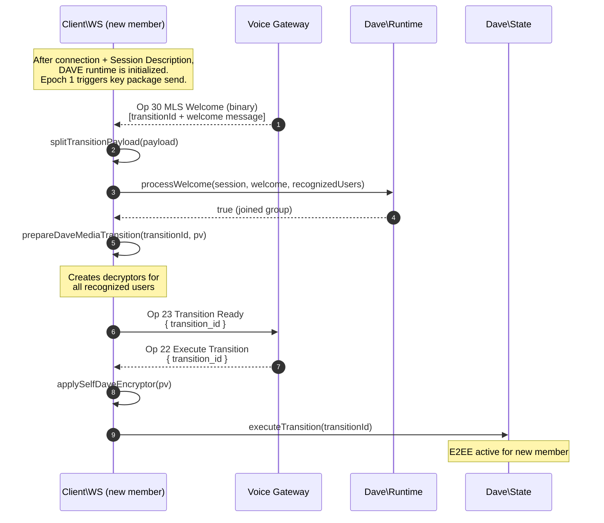
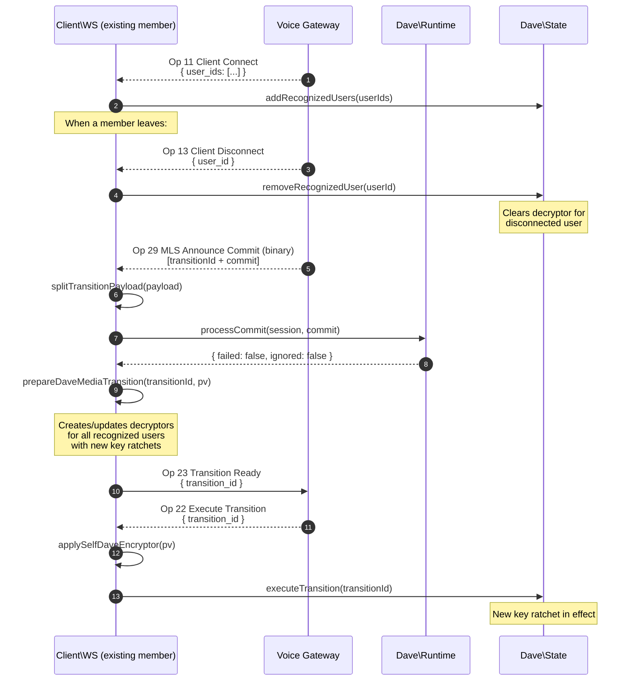
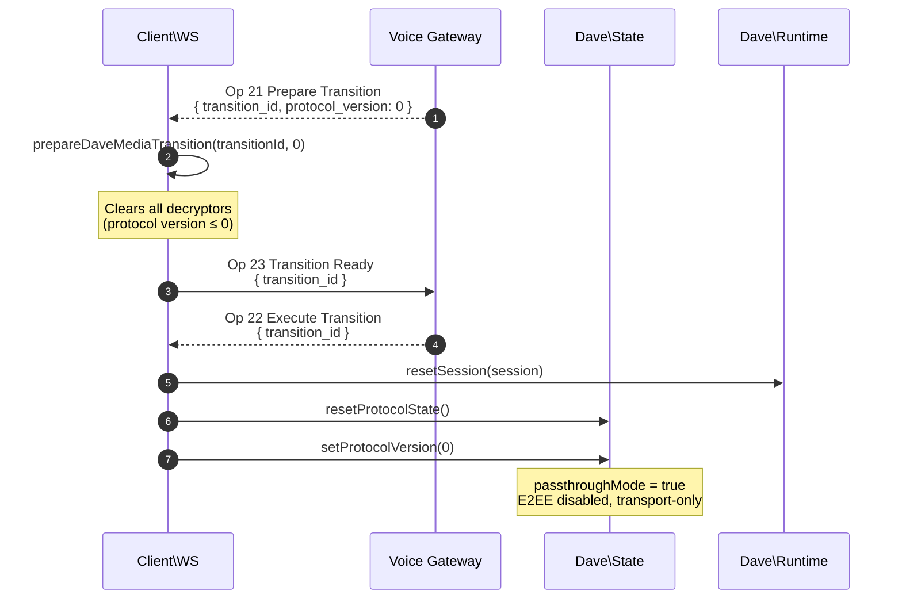
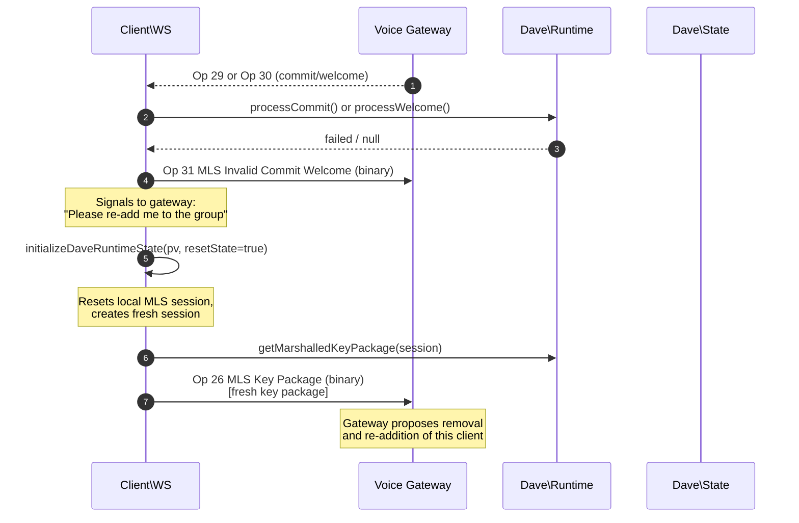
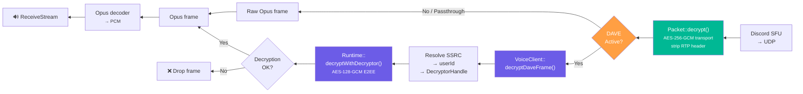
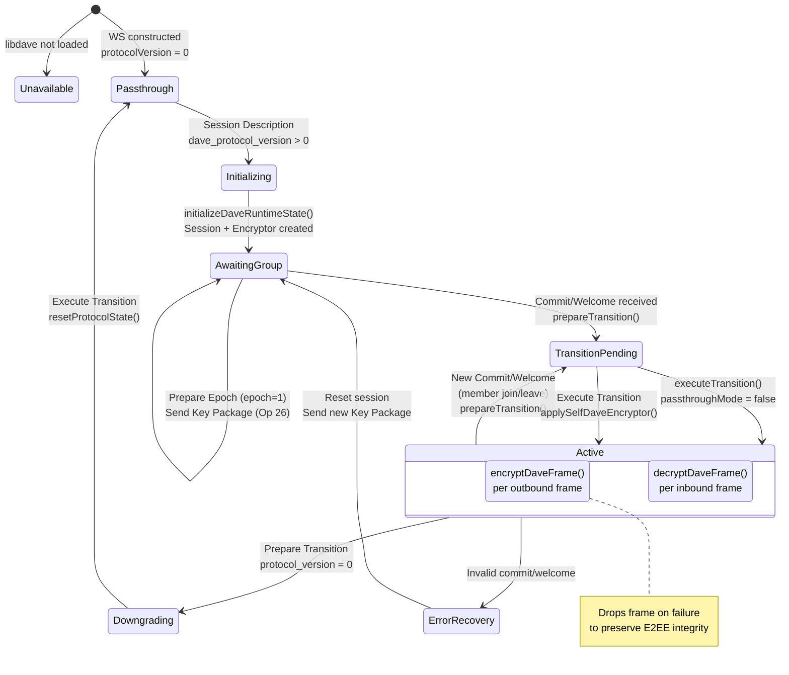

# DAVE — Discord Audio/Video End-to-End Encryption

This document provides visual diagrams of how DiscordPHP-Voice implements the [DAVE E2EE protocol](https://discord.com/developers/docs/topics/voice-connections#end-to-end-encryption-dave-protocol). All diagrams use [Mermaid](https://mermaid.js.org/) syntax, which GitHub renders natively.

For the authoritative protocol specification, see the [DAVE Protocol Whitepaper](https://daveprotocol.com/) and [libdave](https://github.com/discord/libdave).

---

## Table of Contents

- [Architecture Overview](#architecture-overview)
- [Connection & DAVE Initialization](#connection--dave-initialization)
- [MLS Group Lifecycle](#mls-group-lifecycle)
  - [Initial Group Creation (Epoch 1)](#initial-group-creation-epoch-1)
  - [Member Join (Welcome)](#member-join-welcome)
  - [Member Change (Commit)](#member-change-commit)
  - [Downgrade to Protocol v0](#downgrade-to-protocol-v0)
  - [Error Recovery](#error-recovery)
- [Media Frame Encryption Pipeline](#media-frame-encryption-pipeline)
- [DAVE State Machine](#dave-state-machine)
- [Voice Gateway DAVE Opcodes](#voice-gateway-dave-opcodes)

---

## Architecture Overview

How the DAVE-related classes relate to each other within the library.



---

## Connection & DAVE Initialization

The sequence from joining a voice channel to having DAVE fully initialized.



---

## MLS Group Lifecycle

### Initial Group Creation (Epoch 1)

When a new MLS group is being formed (e.g. the first two members join a call).



### Member Join (Welcome)

When a new member is being added to an existing MLS group.



### Member Change (Commit)

When a member joins or leaves, existing group members receive a commit to advance the MLS epoch.



### Downgrade to Protocol v0

When E2EE must be disabled (e.g. a client without DAVE support joins during the transition phase).



### Error Recovery

When a commit or welcome message can't be processed.



---

## Media Frame Encryption Pipeline

How audio frames are encrypted (outbound) and decrypted (inbound) through the two encryption layers: DAVE E2EE (frame-level) and transport encryption (packet-level).

### Outbound (Sending Audio)

```mermaid
flowchart LR
    A["🎤 Raw PCM"] --> B["Ffmpeg::encode()<br/><small>PCM → Opus</small>"]
    B --> C["OggStream<br/><small>Ogg container parsing</small>"]
    C --> D["playOggStream()<br/><small>Buffers frames,<br/>manages timing</small>"]
    D --> E{"DAVE<br/>Active?"}
    E -->|Yes| F["VoiceClient::<br/>encryptDaveFrame()"]
    E -->|No / Passthrough| G["Raw Opus frame"]
    F --> H["Runtime::<br/>encryptWithEncryptor()<br/><small>AES-128-GCM E2EE</small>"]
    H --> H2{"Encryption<br/>OK?"}
    H2 -->|Yes| I["Packet::encrypt()<br/><small>AES-256-GCM transport<br/>+ RTP header</small>"]
    H2 -->|No + Active| X["❌ Drop frame<br/><small>Preserves E2EE integrity</small>"]
    H2 -->|No + Passthrough| G
    G --> I
    I --> J["UDP::sendBuffer()<br/><small>→ Discord SFU</small>"]

    style E fill:#ff9f43,color:#fff
    style F fill:#6c5ce7,color:#fff
    style H fill:#6c5ce7,color:#fff
    style I fill:#00b894,color:#fff
```



### Inbound (Receiving Audio)



### Two-Layer Encryption Stack

```
┌─────────────────────────────────────────────────────────────────────┐
│                         UDP Packet (wire)                          │
│  ┌───────────────────────────────────────────────────────────────┐  │
│  │              Transport Encryption (Packet)                    │  │
│  │         AES-256-GCM  •  Key from Session Description         │  │
│  │  ┌─────────────┬─────────────────────────────────────────┐   │  │
│  │  │  RTP Header  │          Encrypted Payload              │   │  │
│  │  │  (12 bytes)  │  ┌───────────────────────────────────┐  │   │  │
│  │  │              │  │      DAVE E2EE (Runtime)          │  │   │  │
│  │  │              │  │  AES-128-GCM  •  Per-sender key   │  │   │  │
│  │  │              │  │  ┌───────────────────────────┐    │  │   │  │
│  │  │              │  │  │    Opus Audio Frame       │    │  │   │  │
│  │  │              │  │  └───────────────────────────┘    │  │   │  │
│  │  │              │  │  + Auth Tag (8B) + Nonce + Magic  │  │   │  │
│  │  │              │  └───────────────────────────────────┘  │   │  │
│  │  └─────────────┴─────────────────────────────────────────┘   │  │
│  └───────────────────────────────────────────────────────────────┘  │
└─────────────────────────────────────────────────────────────────────┘
```

---

## DAVE State Machine

The lifecycle of `Dave\State` through protocol transitions.



---

## Voice Gateway DAVE Opcodes

All DAVE-related opcodes handled by `Client\WS`.

| Opcode | Name | Direction | Format | Handler Method | Description |
|--------|------|-----------|--------|----------------|-------------|
| 21 | `DAVE_PREPARE_TRANSITION` | Server → Client | JSON | `handleDavePrepareTransition` | Announces an upcoming downgrade from the DAVE protocol. Contains `transition_id` and `protocol_version`. |
| 22 | `DAVE_EXECUTE_TRANSITION` | Server → Client | JSON | `handleDaveExecuteTransition` | Confirms execution of a pending transition. Sent after all participants are ready or timeout. |
| 23 | `DAVE_TRANSITION_READY` | Client → Server | JSON | `handleDaveTransitionReady` | Client signals it has prepared local state and is ready to execute the transition. |
| 24 | `DAVE_PREPARE_EPOCH` | Server → Client | JSON | `handleDavePrepareEpoch` | Announces a protocol version change or new MLS epoch. `epoch: 1` means a new group is being created. |
| 25 | `DAVE_MLS_EXTERNAL_SENDER` | Server → Client | **Binary** | `handleDaveMlsExternalSender` | Provides the voice gateway's external sender credential for the MLS group. |
| 26 | `DAVE_MLS_KEY_PACKAGE` | Client → Server | **Binary** | `handleDaveMlsKeyPackage` | Client sends its MLS key package so it can be proposed for group addition. |
| 27 | `DAVE_MLS_PROPOSALS` | Server → Client | **Binary** | `handleDaveMlsProposals` | Contains MLS Add/Remove proposals from the external sender. Client must process and produce a commit. |
| 28 | `DAVE_MLS_COMMIT_WELCOME` | Both | **Binary** | `handleDaveMlsCommitWelcome` | Client sends its MLS commit (and optional welcome messages) to the gateway. The gateway may also dispatch it back; the "winning" commit is broadcast via Op 29/30. |
| 29 | `DAVE_MLS_ANNOUNCE_COMMIT_TRANSITION` | Server → Client | **Binary** | `handleDaveMlsAnnounceCommitTransition` | Gateway broadcasts the winning commit to existing group members with a transition ID. |
| 30 | `DAVE_MLS_WELCOME` | Server → Client | **Binary** | `handleDaveMlsWelcome` | Gateway sends an MLS Welcome to new members being added to the group. |
| 31 | `DAVE_MLS_INVALID_COMMIT_WELCOME` | Client → Server | **Binary** | `handleDaveMlsInvalidCommitWelcome` | Client signals that a commit/welcome was unprocessable. Triggers error recovery (removal + re-addition). A defensive inbound handler also exists. |

### Binary Frame Format

Binary DAVE messages use a compact format instead of JSON:

```
Server → Client:
┌──────────────────┬────────┬──────────────────────┐
│  Sequence Number │ Opcode │      Payload         │
│   (2 bytes, BE)  │(1 byte)│   (variable bytes)   │
└──────────────────┴────────┴──────────────────────┘

Client → Server:
┌────────┬──────────────────────┐
│ Opcode │      Payload         │
│(1 byte)│   (variable bytes)   │
└────────┴──────────────────────┘
```

The sequence number is tracked in `Dave\State::lastReceivedSequence` and included in heartbeat (`seq_ack`) and resume payloads for [buffered resume](https://discord.com/developers/docs/topics/voice-connections#resuming-voice-connection) support.

---

## Key Source Files

| File | Role |
|------|------|
| `src/Discord/Voice/Manager.php` | Entry point — validates libdave availability |
| `src/Discord/Voice/VoiceClient.php` | `encryptDaveFrame()` / `decryptDaveFrame()` |
| `src/Discord/Voice/Client/WS.php` | All DAVE gateway opcode handlers |
| `src/Discord/Voice/Client/Packet.php` | RTP transport encryption with DAVE callbacks |
| `src/Discord/Voice/Dave/State.php` | Per-connection MLS state tracking |
| `src/Discord/Voice/Dave/Runtime.php` | FFI singleton wrapping native libdave |
| `src/Discord/Voice/Dave/BinaryFrame.php` | Binary DAVE frame parsing/serialisation |
| `src/Discord/Voice/Dave/SessionHandle.php` | Opaque MLS session handle |
| `src/Discord/Voice/Dave/EncryptorHandle.php` | Opaque media encryptor handle |
| `src/Discord/Voice/Dave/DecryptorHandle.php` | Opaque media decryptor handle |
| `src/Discord/Voice/Dave/KeyRatchetHandle.php` | Opaque key ratchet handle |
| `src/Discord/Voice/Dave/NativeHandle.php` | Abstract base for FFI handle lifecycle |
